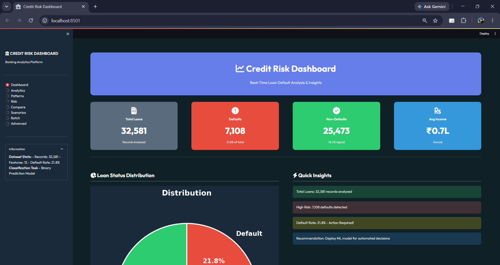
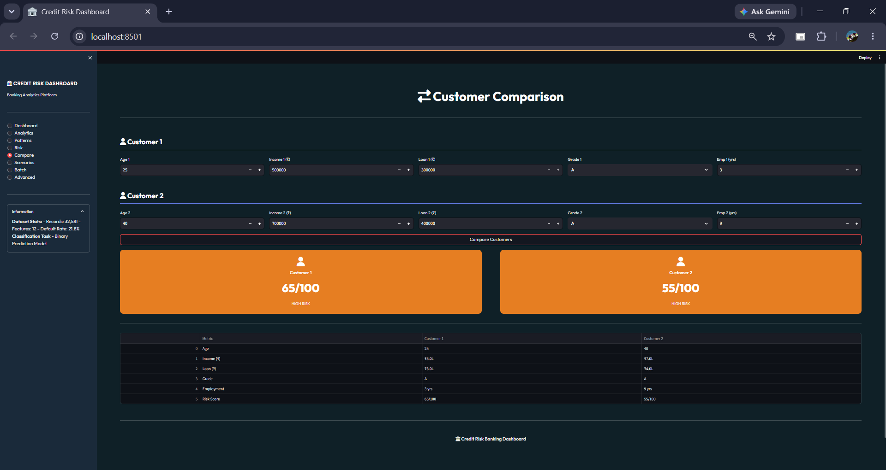
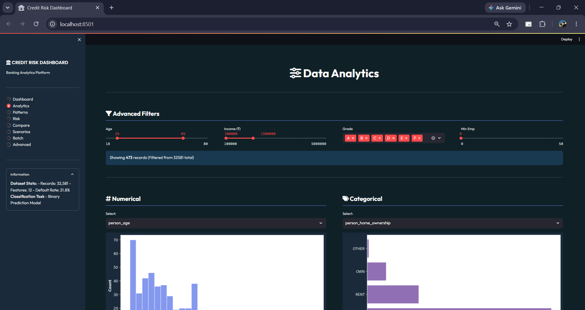
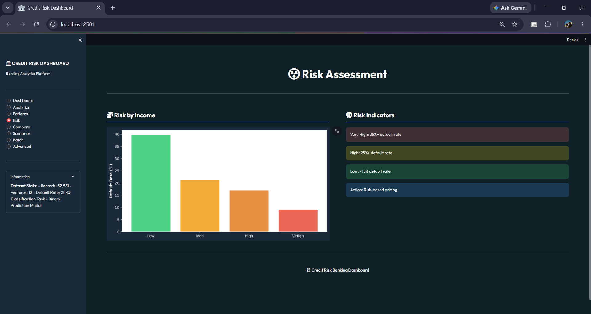
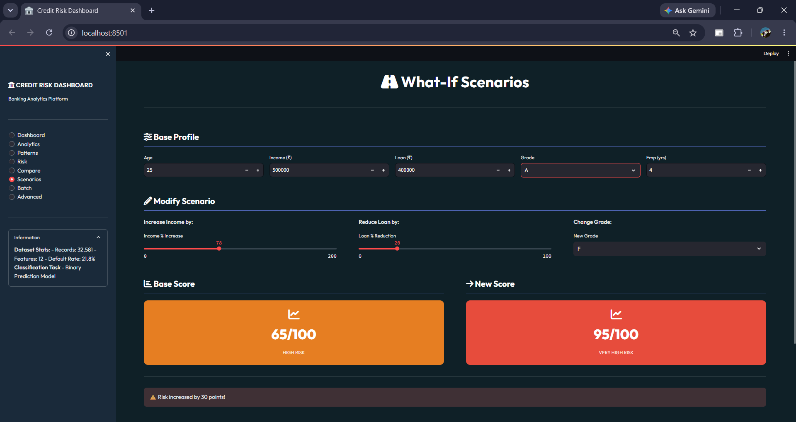

# Credit Risk Banking Dashboard

A Streamlit-based analytics dashboard for credit risk assessment and loan default analysis. This project helps explore customer loan data, identify potential risk factors, and support better lending decisions through interactive visualizations and risk scoring.

## Overview

Financial institutions need reliable ways to evaluate loan applicants and minimize the chances of default. This project provides an interactive dashboard that analyzes loan data and helps users understand customer risk profiles through visual analytics and risk assessment tools.

The dashboard is built using Python, Streamlit, and data analysis libraries, making it simple to explore trends, compare customers, and perform risk-based decision making.

---

## Features

### Dashboard

* Overview of loan portfolio statistics
* Total loans, defaults, and repayment metrics
* Quick risk score calculator
* Loan status distribution

### Analytics

* Interactive filters for customer analysis
* Numerical and categorical data exploration
* Dynamic charts and visualizations

### Risk Assessment

* Customer risk evaluation
* Risk categorization based on financial factors
* Lending recommendations

### Customer Comparison

* Compare multiple customer profiles
* Side-by-side risk analysis
* Decision support insights

### What-If Scenario Analysis

* Simulate income changes
* Evaluate loan amount adjustments
* Analyze the impact of different customer attributes

### Batch Assessment

* Upload CSV files
* Evaluate multiple customers at once
* Export processed results

### Advanced Analytics

* Custom filtering options
* Detailed data exploration
* Export analysis results

---

## Dashboard Screenshots

### Dashboard Overview



### Analytics Page



### Risk Assessment



### Customer Comparison



### What-If Scenario Analysis



---

## Technology Stack

| Category             | Technology          |
| -------------------- | ------------------- |
| Frontend             | Streamlit           |
| Programming Language | Python              |
| Data Analysis        | Pandas, NumPy       |
| Visualization        | Matplotlib, Seaborn |
| Machine Learning     | Scikit-Learn        |
| Dataset              | CSV                 |

---

## Dataset Information

* Total Records: 32,581
* Features: 12
* Target Variable: Loan Status
* Default Rate: 21.8%

The dataset contains customer demographic, employment, income, and loan-related information used to analyze repayment behavior and credit risk.

---

## Installation and Setup

### Clone Repository

```bash
git clone https://github.com/T-Sid-1025/ML-credit-risk-dashboard-.git
cd ML-credit-risk-dashboard-
```

### Install Dependencies

```bash
pip install -r requirements.txt
```

### Run Application

```bash
streamlit run app.py
```

Open your browser and visit:

```text
http://localhost:8501
```

---

## Project Structure

```text
ML-credit-risk-dashboard-
│
├── app.py
├── ml_pipeline.py
├── credit_risk_dataset.csv
├── requirements.txt
├── README.md
│
├── screenshots/
│   ├── dashboard.png
│   ├── analytics.png
│   ├── risk.png
│   ├── comparison.png
│   └── scenario.png
│
├── 01_EDA.ipynb
├── EDA_SUMMARY.txt
└── EDA_INSIGHTS.txt
```

---

## Future Improvements

* Machine Learning Model Integration
* Approval Recommendation Engine
* Customer Segmentation
* Portfolio Risk Analysis
* PDF Report Generation
* Feature Importance Analysis

---

## Author

### Siddhant Tagare

Agentic AI Intern – Innomatics Research Labs

GitHub: https://github.com/T-Sid-1025

LinkedIn: https://linkedin.com/in/siddhanttagare

---

If you find this project useful, feel free to star the repository and share your feedback.
